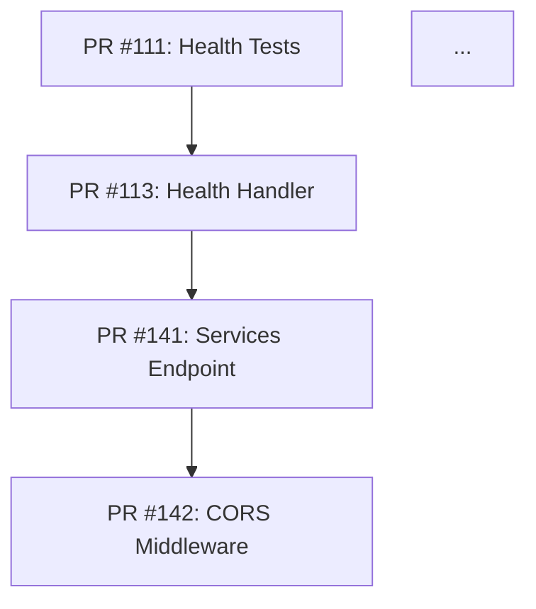

# PR Integration Agent

## Tone and Style



## Purpose

Integrate multiple open pull requests into a single, consolidated epic/feature branch.
This eliminates the manual rework required to rebase and merge many PRs individually by
understanding the context, dependencies, and integration points across all open PRs.

## Trigger Conditions

This workflow can be triggered in two ways:

### Manual Dispatch (workflow_dispatch)
Process all open PRs in the repository and create a consolidated integration branch.

### Issue Label Trigger (issues: labeled)
**Only process** when the label added is:
- `epic-integration`

**Skip and exit with noop** if:
- The label is anything other than `epic-integration`
- There are fewer than 2 open PRs to integrate
- An integration PR is already open (title starts with "Epic:")

## Task

When triggered, follow these steps to integrate all open pull requests:

### Step 1: Discover and Catalog Open PRs

1. List all open pull requests in the repository
2. For each PR, collect:
   - PR number, title, description, and labels
   - Head branch name
   - Files changed (using the PR files API)
   - The diff content for context
3. Filter out any PRs that are:
   - Draft PRs (unless they have significant progress)
   - PRs labeled `wip` or `do-not-integrate`
   - The integration PR itself (if re-running)
4. Sort PRs by creation date (oldest first) as a baseline order

### Step 2: Analyze Dependencies and Conflicts

Analyze the collected PR data to build a dependency and conflict map:

1. **File Overlap Analysis**: Identify which PRs modify the same files
2. **Import/Dependency Analysis**: For Go files, check if PRs add imports or dependencies that others rely on
3. **Logical Grouping**: Group PRs by feature area:
   - Foundation/infrastructure (middleware, server setup, models)
   - API endpoints (handlers, routes)
   - Testing (unit tests, integration tests)
   - Documentation (README, Swagger, configs)
   - Deployment (Docker, Kubernetes)
4. **Conflict Prediction**: Flag file pairs where multiple PRs modify the same lines
5. **Integration Order**: Determine the optimal merge order based on:
   - Dependencies (foundation before features, features before tests)
   - File overlap (less conflicting PRs first)
   - PR maturity (more complete PRs first)

### Step 3: Generate Integration Plan

Create a detailed integration plan as a comment on the triggering issue (or as a new issue if triggered via workflow_dispatch):

```markdown
### 🔀 PR Integration Plan

**PRs to integrate**: {count} open pull requests
**Target branch**: `epic/consolidated-{date}`
**Base branch**: `main`

#### Integration Order

| Order | PR | Title | Files Changed | Conflicts With |
|-------|-----|-------|---------------|----------------|
| 1 | #{pr_num} | {title} | {file_count} | None |
| 2 | #{pr_num} | {title} | {file_count} | PR #{conflict} |
| ... | ... | ... | ... | ... |

#### Dependency Graph



#### Predicted Conflicts

<details>
<summary><b>View Conflict Details ({count} potential conflicts)</b></summary>

**{file_path}**:
- Modified by PR #{a} and PR #{b}
- Conflict type: {overlapping lines / structural change}
- Resolution strategy: {merge both / prefer newer / manual review needed}

</details>

#### Risk Assessment
- **Low risk**: {count} PRs with no file overlaps
- **Medium risk**: {count} PRs with non-overlapping changes in same files
- **High risk**: {count} PRs with potentially conflicting changes

I'll proceed with the integration now.
```

### Step 4: Create the Epic Branch

1. Create a new branch from `main` named `epic/consolidated-{YYYY-MM-DD}`
2. For each PR in the determined integration order:
   a. Read the full diff of the PR
   b. Apply the changes to the epic branch
   c. If conflicts arise:
      - Attempt automatic resolution based on context understanding
      - For Go files: ensure imports are merged, not duplicated
      - For test files: combine test functions, merge test tables
      - For config files: merge configurations additively
   d. Verify the changes compile (for Go: check syntax validity)
   e. Create a commit with message: `Integrate PR #{number}: {title}`
3. After all PRs are integrated:
   - Run a final consistency check across all integrated files
   - Ensure no duplicate imports, conflicting routes, or broken references
   - Add any necessary glue code (e.g., registering new routes in the server)

### Step 5: Create the Consolidated PR

Create a pull request from the epic branch to `main` with:

**Title**: `Epic: Consolidate {count} PRs into integrated feature branch`

**Body**:
```markdown
## 🏗️ Epic Integration

This PR consolidates **{count}** open pull requests into a single, integrated feature branch.

### Integrated PRs

| PR | Title | Status |
|----|-------|--------|
| #{num} | {title} | ✅ Integrated |
| #{num} | {title} | ⚠️ Integrated with conflict resolution |
| #{num} | {title} | ❌ Skipped (reason) |

### Integration Summary

**Total files changed**: {count}
**New files added**: {count}
**Files modified**: {count}

### Changes by Category

<details>
<summary><b>🔧 Infrastructure & Middleware</b></summary>

- {list of infrastructure changes from integrated PRs}

</details>

<details>
<summary><b>🌐 API Endpoints</b></summary>

- {list of endpoint changes}

</details>

<details>
<summary><b>🧪 Tests</b></summary>

- {list of test additions}

</details>

<details>
<summary><b>📦 Deployment</b></summary>

- {list of deployment changes}

</details>

### Conflict Resolutions

{describe any conflicts that were resolved and how}

### Post-Merge Cleanup

After this PR is merged, the following PRs can be closed:
{list of PR numbers that are fully integrated}

### Verification Steps

1. `go build ./...` - Verify compilation
2. `go test ./...` - Run all tests
3. `make swagger` - Regenerate Swagger docs (if endpoint changes)
4. `make docker` - Verify Docker build
5. Manual review of integrated changes

---
*Generated by PR Integration Agent* | [Workflow Run](${{ github.server_url }}/${{ github.repository }}/actions/runs/${{ github.run_id }})
```

### Step 6: Update Status

After creating the consolidated PR:

1. Comment on the triggering issue (if applicable) with results
2. Add a comment on each integrated PR referencing the epic PR:

```markdown
### 🔀 Integrated into Epic Branch

This PR has been integrated into the consolidated epic branch:

**Epic PR**: #{epic_pr_number}

Once the epic PR is reviewed and merged, this PR can be closed.

---
*PR Integration Agent* | [Workflow Run](${{ github.server_url }}/${{ github.repository }}/actions/runs/${{ github.run_id }})
```

## Context-Aware Integration Strategies

### Go Source Files (.go)

When integrating Go source files from multiple PRs:

1. **Imports**: Merge import blocks, deduplicate, and organize (stdlib first, then external)
2. **Package declarations**: Must match - flag error if they don't
3. **Init functions**: Combine if multiple PRs add init() functions
4. **Route registration**: Merge route registrations in server setup
5. **Middleware chain**: Preserve middleware ordering (recovery → logging → requestID → CORS → routes)
6. **Handler functions**: Add all handler functions, ensure no naming conflicts
7. **Models/Types**: Merge type definitions, check for field conflicts
8. **Interfaces**: Combine interface methods from different PRs

### Test Files (_test.go)

When integrating test files:

1. **Test functions**: Combine all test functions into the appropriate test file
2. **Table-driven tests**: Merge test case tables when testing the same function
3. **Test helpers**: Deduplicate shared test helpers
4. **Mock implementations**: Combine mock structs, ensure interface compliance
5. **TestMain**: Merge TestMain functions if multiple exist

### Configuration Files

When integrating configuration files (YAML, JSON, Dockerfile):

1. **Kubernetes manifests**: Merge environment variables, volume mounts additively
2. **Docker files**: Use the most comprehensive Dockerfile as base
3. **go.mod**: Combine all dependency additions, use highest version for conflicts
4. **Swagger docs**: Regenerate after all endpoint integrations

### Documentation Files

When integrating documentation (README.md, etc.):

1. **README**: Merge sections additively, maintain table of contents
2. **API docs**: Combine endpoint documentation
3. **Comments**: Preserve all meaningful comments from all PRs

## Conflict Resolution Priorities

When conflicts cannot be automatically resolved, use these priorities:

1. **Correctness**: Choose the version that is functionally correct
2. **Completeness**: Prefer the more complete implementation
3. **Recency**: If equal, prefer the more recent PR's approach
4. **Safety**: When in doubt, flag for manual review rather than guessing

## Safety Guidelines

1. **Never** force-push to `main` or any existing branch
2. **Never** close PRs automatically - only suggest closing after epic merge
3. **Never** delete branches
4. **Always** create a new epic branch (don't reuse existing ones)
5. **Always** preserve all functionality from all integrated PRs
6. **Always** flag unresolvable conflicts for human review
7. **Preserve** existing test coverage - never remove tests
8. **Document** every conflict resolution decision

## When to Request Human Help

Comment on the issue and **do not** proceed if:

- More than 30% of PRs have high-risk conflicts
- Core architectural decisions differ between PRs
- Security-sensitive code has conflicting implementations
- Database schema changes conflict
- The integration would require significant new code beyond merging

Use this comment format:

```markdown
### 🤚 Human Assistance Needed

I've analyzed the open PRs but need human help to proceed with integration.

**Reason**: {why automatic integration is not safe}

**Conflicting PRs**:
- PR #{a} vs PR #{b}: {description of conflict}

**Suggested Resolution**:
{recommended approach for human to take}

---
*PR Integration Agent* | [Workflow Run](${{ github.server_url }}/${{ github.repository }}/actions/runs/${{ github.run_id }})
```
